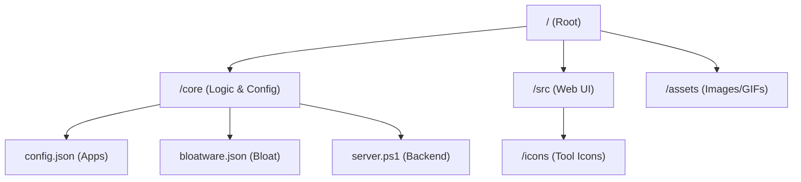

# Contributing to Windows Dev Bootstrap

First off, thank you for considering contributing! This project thrives on community-added tools and improvements.

## Repository Structure

We've organized the codebase to keep the root clean:



- **`core/`**: Contains the PowerShell logic and JSON configuration files.
- **`src/`**: Contains the HTML/CSS/JS for the local web interface.
- **`assets/`**: Project images and branding.

---

## How to Add a New Tool

The most common way to contribute is by adding a tool to `core/config.json`.

### 1. Define the tool
Add a new object to the appropriate category in `core/config.json`:

```json
{
  "name": "Tool Name",
  "recommended": false,
  "iconFile": "tool-icon.svg",
  "method": "winget",
  "id": "Publisher.ToolID",
  "pin_to_taskbar": true
}
```

### 2. Add the icon
Place a high-quality SVG or WebP icon in `src/icons/`. The `iconFile` property in the JSON must match this filename.

---

## Modifying Bloatware List
If you found more Windows bloat that should be removed, add it to `core/bloatware.json`.

## Improving the Engine
- **Backend**: Core logic is in `core/server.ps1`.
- **Frontend**: UI logic is in `src/js/script.js`.

## Pull Request Process
1. **Fork** the repository.
2. Create a **feature branch** (`git checkout -b feat/add-my-tool`).
3. **Commit** your changes with a clear message (`feat: add vim editor`).
4. **Push** to your fork and submit a **Pull Request**.

## Code of Conduct
Please be respectful and constructive in all interactions.

Happy Bootstrapping! 🚀
