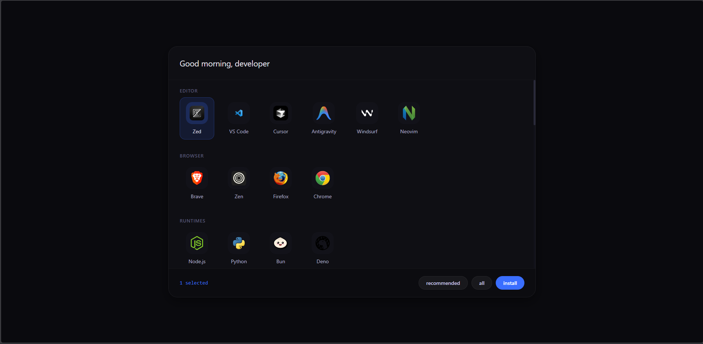

<div align="center">
  
  <h1>Windows Dev Bootstrap</h1>
  <p><strong>The ultimate automated setup for Windows development environments.</strong></p>

  [](https://github.com/Atnatewoss/windows-dev-bootstrap/stargazers)
  [](https://github.com/Atnatewoss/windows-dev-bootstrap/network/members)
  [](LICENSE)
  [](CONTRIBUTING.md)

  <p>Transform a 2-hour manual install into a 10-minute automated experience.</p>
  
  [Quick Start](#quick-start) • [Features](#features) • [Roadmap](#roadmap) • [Contributing](#contributing)
</div>

---

## Introduction

**Windows Dev Bootstrap** is a zero-dependency, automated toolkit designed to take a fresh Windows installation to a fully configured developer workstation in one command. It leverages a local PowerShell-based web server to provide a modern interface for managing your setup without requiring Node.js, Python, or any other pre-installed runtimes.

<p align="center">
  
</p>

## Features

- **Zero-Dependency Engine**: Runs completely natively on Windows. No pre-requisites.
- **Modern Web Interface**: A local `HttpListener` server serves a sleek UI for tool selection.
- **Smart App Management**: Handles `winget` packages, direct ZIP downloads, and auto-extraction.
- **Taskbar Automation**: Programmatically pins installed apps to your taskbar in real-time.
- **Secure by Design**: Git and PostgreSQL credentials are processed strictly locally. No telemetry.
- **Network Performance**: Background speed tests estimate download times based on your connection.
- **Advanced Modularity**: Centralized JSON configuration for apps and bloatware removal.

## Quick Start

Open **PowerShell as Administrator** and run the following one-liner:

```powershell
irm https://raw.githubusercontent.com/Atnatewoss/windows-dev-bootstrap/main/bootstrap.ps1 | iex
```

> [!IMPORTANT]
> Ensure you run PowerShell as Administrator to allow for `winget` installations and `PATH` modifications.

## Core Toolset

The UI provides a curated list of tools, fully customizable via `core/config.json`:

| Category | Recommended Tools |
| :--- | :--- |
| **Editors** | Zed, VS Code, Cursor, Neovim |
| **Runtimes** | Node.js LTS, Python 3.12, Bun, Deno |
| **Databases** | PostgreSQL 16 (Auto-Init), MySQL |
| **Utilities** | Bitwarden, LocalSend, ProtonVPN |
| **Native Apps** | Windows Terminal, Sticky Notes (Auto-Pinned) |

## 🗺️ Roadmap

- [ ] **Presets Support**: One-click selection for "Frontend", "Backend", or "Fullstack" profiles.
- [ ] **WSL2 Auto-Config**: Scripted installation of WSL2 with Ubuntu.
- [ ] **Dotfiles Integration**: Import your custom `.bashrc`, `.zshrc`, or `.vimrc` directly.
- [ ] **Dark/Light Mode**: Dynamic UI themes.
- [ ] **Telemetry (Opt-in)**: Anonymous success/fail rates to improve Winget ID accuracy.

## Contributing

We love contributions! Whether you're adding a new tool to `config.json` or improving the PowerShell backend, check out our [Contributing Guide](CONTRIBUTING.md) to get started.

## License

This project is licensed under the MIT License - see the [LICENSE](LICENSE) file for details.

---

<div align="center">
  Made by <a href="https://github.com/Atnatewoss">Atnatewoss</a>
</div>
